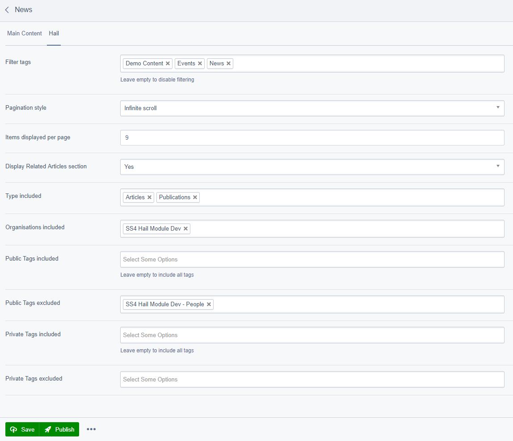

# Hail.to Integration for SilverStripe 4 

Silverstripe 4 module to integrate with Hail (https://get.hail.to)

If you need this module for SilverStripe 3 please refer to [this branch](https://github.com/firebrandhq/silverstripe-hail/tree/2.x).

:exclamation: **If you are getting errors while fetching, please update to 4.2 version**

## Features

* Display Hail content inside your SilverStripe website
* Ready to use with Bootstrap 4.1 styles and templates
* Video and Image header for articles and publications
* Hail Page
* TinyMCE plugin
* Configurable
* Simplified code base
* Emojis support as an option
* SEO friendly
* OpenGraph integration, [see OpenGraph Support section](#opengraph-support)
* Silverstripe Elemental integration, [see SilverStripe Elemental Support section](#silverstripe-elemental-support)
* And more...

## Requirements

* [PHP ^7.1](https://secure.php.net/)
* [SilverStripe ^4.4](https://www.silverstripe.org/download)
* [guzzlehttp/guzzle ^6.3](https://github.com/guzzle/guzzle)
* [silverstripe/environmentcheck ^2.0](https://github.com/silverstripe/silverstripe-environmentcheck)
* [symfony/console ^4.2](https://github.com/symfony/console)
* Access to create cronjob (optional)
* jQuery and Bootstrap 4+ (included), [see jQuery and Boostrap requirements](#jquery-and-bootstrap-requirements)

For SilverStripe 4.1 to 4.3 use version 4.2.1

## Upgrade from older versions

This module has been re written for SilverStripe 4 and includes breaking changes compared to previous version.
Please perform a fresh install if you are upgrading from previous versions by removing and re installing the module.

## Installation

**Run the following command:**

```sh
composer require firebrandhq/silverstripe-hail "^4"
```

**(Optional) Enable Emojis Support (has to be done before doing the dev/build):**

[See Emojis Support configuration](#emojis-support)

**Install Silverstripe Sake:** 

```sh
cd your-webroot/
sudo ./vendor/bin/sake installsake
```
*Please ensure sake is using php ^7.1*

**Perform a dev/build**

**Add the following lines (adapt them to your environment) to your crontab:**

__**You need to add those jobs to the cronjob of the user running your webserver (example on Ubuntu with apache2: sudo crontab -e -u www-data)**__

```sh
* * * * * cd /your-webroot/ && /usr/local/bin/sake dev/tasks/hail-fetch-queue
*/5 * * * * cd /your-webroot/ && /usr/local/bin/sake dev/tasks/hail-check-status
0 * * * * cd /your-webroot/ && /usr/local/bin/sake dev/tasks/hail-fetch-recurring
```

You can adapt the frequency of the hail-fetch-recurring job to your needs, it will always fetch up until previous fetch

#### Authorize Silverstripe to fetch from Hail:

1. Go to hail.to and signin, then go to your Developer Settings (https://hail.to/app/user/applications) and create a new application (Add new button)
2. Add the generated Hail Client ID and Client Secret to your .env file:

    ```
    HAIL_CLIENT_ID=[CLIENTID]
    HAIL_CLIENT_SECRET=[CLIENTSECRET]
    ```
3. Go to SilverStripe admin settings page (/admin/settings/), then on the Hail tab
4. Copy the Callback URL
5. Back to the Hail Developer Settings, Click "Add new" in the redirect URI section and paste the Callback URL
6. You are now ready to authorize your Hail application, go back to the SilverStripe Admin settings and click the "Authorise SilverStripe to Access Hail" button.
7. After the authorization process is complete, you will be able to select the Hail Organisation(s) you want to fetch content from in the Admin Settings of SilverStripe.
8. (Optional) You can globally exclude content with specific Public or Private tags in the Admin Settings of SilverStripe
9. Save your Admin Settings

You can now either wait for your cron job to fetch the content or force a full fetch from the Hail menu in SilverStripe CMS using the Fetch button (top left in the page).

## jQuery and Bootstrap requirements

We include jQuery 3.3.1 and Bootstrap 4.1 (javascript and css) in our Hail Page and Hail Articles by default.

If you need to include your own jQuery and/or Bootstrap (If you compiled Bootstrap from source or want to include those globally for example), simply block our requirement(s) by adding one or all the following to your PageController init() function:

```php
protected function init()
{
    parent::init();
    // You can include any CSS or JS required by your project here.
    // See: https://docs.silverstripe.org/en/developer_guides/templates/requirements/
    
    \SilverStripe\View\Requirements::block('firebrandhq/silverstripe-hail: thirdparty/bootstrap/styles/bootstrap.min.css');
    \SilverStripe\View\Requirements::block('firebrandhq/silverstripe-hail: thirdparty/jquery/js/jquery.min.js');
    \SilverStripe\View\Requirements::block('firebrandhq/silverstripe-hail: thirdparty/bootstrap/js/bootstrap.bundle.min.js');
}
```


## Configuration

The following yml configuration options are available for override:

**Hail API Client configuration:**
- BaseApiUrl: Base URL of the Hail API
- AuthorizationUrl: Full URL of the Hail authorization
- RefreshRate: Time after which a Hail Object is considered outdated
- EnableEmojiSupport: See [Emojis Support configuration](#emojis-support)
- OnlyFetchPublishedObjects: By default the Hail module only fetches published objects, you can change this behavior by setting this value to false

*Default configuration:*
 
```yml
Firebrand\Hail\Api\Client:
  BaseApiUrl: 'https://hail.to/api/v1/'
  AuthorizationUrl: 'https://hail.to/oauth/authorise'
  RefreshRate: 86400
  EnableEmojiSupport: false
  OnlyFetchPublishedObjects: true
```

**Hail Page Controller configuration:**
- UseDefaultCss: true / false Enables the default styles on Hail Pages and articles (Using Bootstrap 4.1)

*Default configuration:*
 
```yml
Firebrand\Hail\Pages\HailPageController:
  UseDefaultCss: true
```

**Hail Recurring Fetch Task configuration:**
- Emails: Fetching errors will be sent to the following email list (comma separated), put to false if you want to disable the emails

*Default configuration:*
 
```yml
Firebrand\Hail\Tasks\FetchRecurringTask:
  Emails: ''
```

**In order to override those values you need to add a new yml file into your mysite/_config/ folder, specifying that your configuration needs to be included after Hail's.**

*Example yml config file:*
```yml

---
Name: 'myhailconfig'
After:
    - '#hail-config'
---
Firebrand\Hail\Api\Client:
  EnableEmojiSupport: true
Firebrand\Hail\Tasks\FetchRecurringTask:
  Emails: 'developers@mycompany.com'
---

```

## Usage

Once everything is configured and your Hail content is fetched you can create a Hail Page in the SilverStripe CMS to display the content on your website.
The configuration of the Hail Page should be self explanatory, see screenshots below: 

Hail Page configuration:



Once configured and published your Hail Page should look like this (using default styles and templates):


## Emojis Support

**IMPORTANT:** Enabling Emojis Support will change the charset and collation of your SilverStripe database to **utf8mb4** and **utf8mb4_general_ci** respectively.

utf8mb4 is backward compatible with utf8 so it should work with any existing or new database, we still chose to disable the feature to avoid imposing this change.

To enable Emojis support please add the following to your SilverStripe yml (following the example below) config and perform a dev/build.

*Example yml config file:*

```yml

---
Name: 'myhailconfig'
After:
    - '#hail-config'
---
Firebrand\Hail\Api\Client:
  EnableEmojiSupport: true
---

```

## OpenGraph Support

You can add OpenGraph Support for the Hail content inside your SilverStripe website by adding an optional module:

[See Hail OpenGraph module for installation instructions](https://github.com/firebrandhq/silverstripe-hail-opengraph/)

## SilverStripe Elemental Support

We offer a pre built SilverStripe Elemental block (Hail Carousel) for you to use:

[See Hail Elemental module for installation instructions](https://github.com/firebrandhq/silverstripe-hail-elemental/)


## Contributing

[See CONTRIBUTING.md](CONTRIBUTING.md)

## Versioning

This library follows [Semver](http://semver.org). According to Semver, you will be able to upgrade to any minor or patch version of this library without any breaking changes to the public API. Semver also requires that we clearly define the public API for this library.

All methods, with `public` visibility, are part of the public API. All other methods are not part of the public API. Where possible, we'll try to keep `protected` methods backwards-compatible in minor/patch versions, but if you're overriding methods then please test your work before upgrading.

## Reporting Issues

Please [create an issue](https://github.com/firebrandhq/silverstripe-hail/issues) for any bugs you've found, or features you're missing.  

